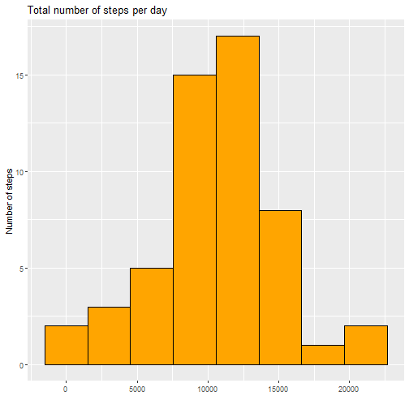
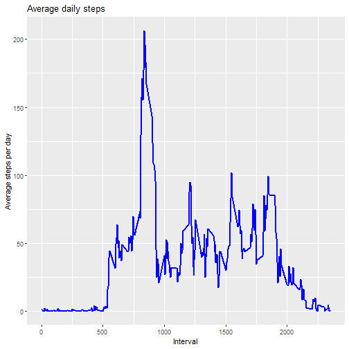
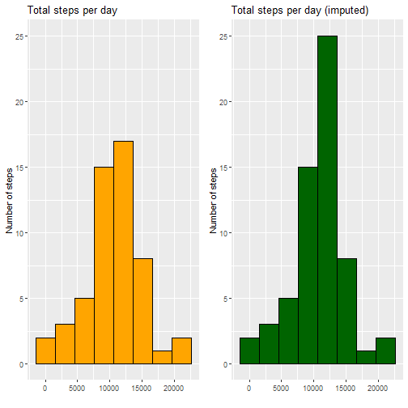
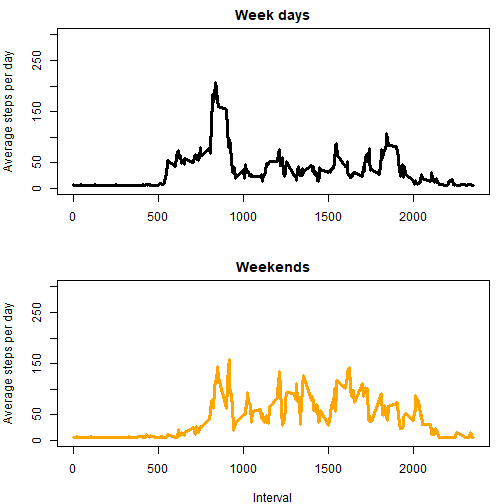
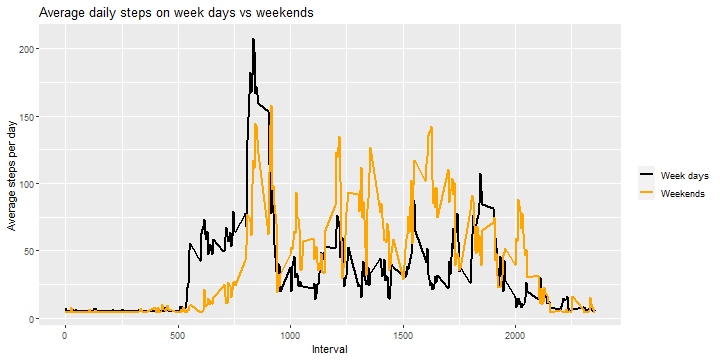

### Problem description

It is now possible to collect a large amount of data about personal
movement using activity monitoring devices such as a
[Fitbit](http://www.fitbit.com), [Nike
Fuelband](http://www.nike.com/us/en_us/c/nikeplus-fuelband), or
[Jawbone Up](https://jawbone.com/up). These type of devices are part of
the "quantified self" movement -- a group of enthusiasts who take
measurements about themselves regularly to improve their health, to
find patterns in their behavior, or because they are tech geeks. But
these data remain under-utilized both because the raw data are hard to
obtain and there is a lack of statistical methods and software for
processing and interpreting the data.

This assignment makes use of data from a personal activity monitoring
device. This device collects data at 5 minute intervals through out the
day. The data consists of two months of data from an anonymous
individual collected during the months of October and November, 2012
and include the number of steps taken in 5 minute intervals each day.


### Data

Dataset: [Activity monitoring data](https://d396qusza40orc.cloudfront.net/repdata%2Fdata%2Factivity.zip) [52K]

The variables included in this dataset are:

* **steps**: Number of steps taking in a 5-minute interval (missing
    values are coded as `NA`)

* **date**: The date on which the measurement was taken in YYYY-MM-DD
    format

* **interval**: Identifier for the 5-minute interval in which
    measurement was taken

# 1. Download and read data

```r
library(data.table)

path <- getwd()
url <- "https://d396qusza40orc.cloudfront.net/repdata%2Fdata%2Factivity.zip"

download.file(url, file.path(path, "data.zip"))
unzip(zipfile = "data.zip")

activity <- data.table::fread(input = "activity.csv")

head(activity)
```

```
##    steps       date interval
## 1:    NA 2012-10-01        0
## 2:    NA 2012-10-01        5
## 3:    NA 2012-10-01       10
## 4:    NA 2012-10-01       15
## 5:    NA 2012-10-01       20
## 6:    NA 2012-10-01       25
```


# 2. What is mean total number of steps taken per day?

```r
library(ggplot2)
stepsPerDay <- aggregate(activity$steps, by=list(activity$date), sum); names(stepsPerDay) <- c("date", "steps")

head(stepsPerDay)
```

```
##         date steps
## 1 2012-10-01    NA
## 2 2012-10-02   126
## 3 2012-10-03 11352
## 4 2012-10-04 12116
## 5 2012-10-05 13294
## 6 2012-10-06 15420
```

```r
ggplot(data=stepsPerDay, aes(x=steps)) + geom_histogram(bins=8, color="black", fill="orange") + labs(x="", y="Number of steps", title="Total number of steps per day")
```

```
## Warning: Removed 8 rows containing non-finite values (stat_bin).
```



```r
summary(stepsPerDay$steps)
```

```
##    Min. 1st Qu.  Median    Mean 3rd Qu.    Max.    NA's 
##      41    8841   10765   10766   13294   21194       8
```


# 3. What is the average daily activity pattern?

```r
library(ggplot2)
stepsPerInterval <- aggregate(activity$steps, by=list(activity$interval), mean, na.rm=TRUE); names(stepsPerInterval) <- c("interval", "avgSteps")

head(stepsPerInterval)
```

```
##   interval  avgSteps
## 1        0 1.7169811
## 2        5 0.3396226
## 3       10 0.1320755
## 4       15 0.1509434
## 5       20 0.0754717
## 6       25 2.0943396
```

```r
ggplot(stepsPerInterval, aes(x = interval , y = avgSteps)) + 
  geom_line(color="blue", size=1) + 
  labs(title = "Average daily steps", x = "Interval", y = "Average steps per day")
```



### Which 5-minute interval, on average across all the days in the dataset, contains the maximum number of steps?

```r
stepsPerInterval[stepsPerInterval$avgSteps==max(stepsPerInterval$avgSteps),]
```

```
##     interval avgSteps
## 104      835 206.1698
```


### Calculate and report the total number of missing values in the dataset

```r
paste("Total number of incomplete rows:", sum(is.na(activity$steps)))
```

```
## [1] "Total number of incomplete rows: 2304"
```

# 4. Imputing missing values
I chose to impute the overall mean of steps because the steps histogram follows a pretty good Gaussian curve, which means data is nicely distributed.

```r
activity2 <- activity
activity2[is.na(steps), "steps"] <- mean(activity$steps, na.rm=TRUE)
```

```
## Warning in `[<-.data.table`(`*tmp*`, is.na(steps), "steps", value =
## 37.3825995807128): 37.382600 (type 'double') at RHS position 1 truncated (precision
## lost) when assigning to type 'integer' (column 1 named 'steps')
```

```r
head(activity)
```

```
##    steps       date interval
## 1:    NA 2012-10-01        0
## 2:    NA 2012-10-01        5
## 3:    NA 2012-10-01       10
## 4:    NA 2012-10-01       15
## 5:    NA 2012-10-01       20
## 6:    NA 2012-10-01       25
```

```r
head(activity2)
```

```
##    steps       date interval
## 1:    37 2012-10-01        0
## 2:    37 2012-10-01        5
## 3:    37 2012-10-01       10
## 4:    37 2012-10-01       15
## 5:    37 2012-10-01       20
## 6:    37 2012-10-01       25
```

### Comparison

```r
library(ggplot2)
library(gridExtra)
stepsPerDay2 <- aggregate(activity2$steps, by=list(activity2$date), sum); names(stepsPerDay2) <- c("date", "steps")

g1 <- ggplot(data=stepsPerDay, aes(x=steps)) + geom_histogram(bins=8, color="black", fill="orange") + labs(x="", y="Number of steps", title="Total steps per day") + coord_cartesian(ylim=c(0,25))

g2 <- ggplot(data=stepsPerDay2, aes(x=steps)) + geom_histogram(bins=8, color="black", fill="darkgreen") + labs(x="", y="Number of steps", title="Total steps per day (imputed)") + coord_cartesian(ylim=c(0,25))


grid.arrange(g1, g2, ncol=2)
```

```
## Warning: Removed 8 rows containing non-finite values (stat_bin).
```



My assumption of a normal Gaussian distribution was good: imputation of the mean did not result in significant deviations from the normal distribution and variance of data is still explained.

Summary of original data:

```r
summary(stepsPerDay$steps)
```

```
##    Min. 1st Qu.  Median    Mean 3rd Qu.    Max.    NA's 
##      41    8841   10765   10766   13294   21194       8
```
Summary of imputed data:

```r
summary(stepsPerDay2$steps)
```

```
##    Min. 1st Qu.  Median    Mean 3rd Qu.    Max. 
##      41    9819   10656   10752   12811   21194
```


```r
print(paste("% change in mean:", (mean(stepsPerDay$steps, na.rm=TRUE) - mean(stepsPerDay2$steps)) / mean(stepsPerDay$steps, na.rm=TRUE) * 100))
```

```
## [1] "% change in mean: 0.134225534753151"
```

```r
print(paste("% change in median:", (median(stepsPerDay$steps, na.rm=TRUE) - median(stepsPerDay2$steps)) / median(stepsPerDay$steps, na.rm=TRUE) * 100))
```

```
## [1] "% change in median: 1.01254064096609"
```

# 5. Are there differences in activity patterns between weekdays and weekends?

**Before you give me a wrong grade on this, my datetime settings are in Portuguese so I had to do this in a different way.**

The easiest way to do this is using grepl() where the pattern searches for "Monday|Tuesday|Wednesday|Thursday|Friday" from the output of weekdays(activity2$date).
Then you just create a new factor variable that defines if it is a "weekday" or "weekend" day, and you perform facet plotting accordingly.

Due to my days being in Portuguese, the grepl() lookup strings needed to be in Portuguese as well, so if you're not PT-PT, the code wouldn't work for you. Please bear this in mind when you are grading.


First step is to subset by weekend and weekday:

```r
activity2$day <- data.frame(weekdays(activity2$date))
activity2 <- transform(activity2, day = factor(day))

weekends <- activity2[activity2$day %in% c(levels(activity2$day)[1], levels(activity2$day)[4])]
weekdays <- activity2[!activity2$day %in% c(levels(activity2$day)[1], levels(activity2$day)[4])]
```

Then plot activity levels:

```r
library(ggplot2)
activityOnWeekends <- aggregate(weekends$steps, by=list(weekends$interval), mean, na.rm=TRUE); names(activityOnWeekends) <- c("interval", "avgSteps")
head(activityOnWeekends)
```

```
##   interval avgSteps
## 1        0    4.625
## 2        5    4.625
## 3       10    4.625
## 4       15    4.625
## 5       20    4.625
## 6       25    7.875
```

```r
activityOnWeekdays <- aggregate(weekdays$steps, by=list(weekdays$interval), mean, na.rm=TRUE); names(activityOnWeekdays) <- c("interval", "avgSteps")
head(activityOnWeekdays)
```

```
##   interval avgSteps
## 1        0 6.955556
## 2        5 5.333333
## 3       10 5.088889
## 4       15 5.111111
## 5       20 5.022222
## 6       25 6.244444
```

```r
par(mfrow=c(2,1), mar=c(4,4,2,1))
plot(type="l", x=activityOnWeekdays$interval, y=activityOnWeekdays$avgSteps, ylab="Average steps per day", xlab="", ylim=c(0,300), lwd=3, main="Week days")

plot(type="l", x=activityOnWeekends$interval, y=activityOnWeekends$avgSteps, ylab="Average steps per day", xlab="Interval", ylim=c(0,300), lwd=3, main="Weekends", col="orange")
```



```r
ggplot() +
  geom_line(data=activityOnWeekdays, aes(x = interval , y = avgSteps, colour="Week days"), size=1) +
  geom_line(data=activityOnWeekends, aes(x = interval , y = avgSteps, colour="Weekends"), size=1) +
  labs(title = "Average daily steps on week days vs weekends", x = "Interval", y = "Average steps per day") +
  scale_colour_manual("", 
                      breaks = c("Week days", "Weekends"),
                      values = c("black", "orange"))
```




